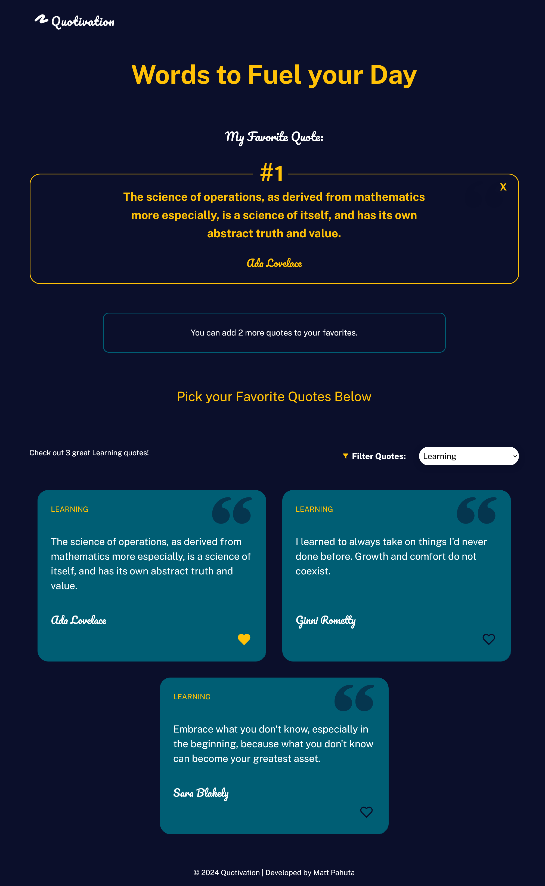

# Quotivation - A ✨ QUOTETASTIC! ✨ React App

A responsive web app built with React that allows users to view and sort through a collection of inspirational quotes, save up to three favorite quotes, and persist saved favorites after browser refresh.

## Table of contents

- [Overview](#overview)
  - [Features](#features)
  - [Screenshot](#screenshot)
  - [Links](#links)
- [My process](#my-process)
  - [Built with](#built-with)
  - [What I learned](#what-i-learned)
- [Author](#author)
- [Acknowledgments](#acknowledgments)

## Overview

### Features:

- Fetch quotes from API
- Filter quotes by category
- Add up to three favorite quotes
- Favorite quotes are saved in LocalStorage
- Display customized messaging 

### Screenshot

### Links

- Live Site URL: [Add live site URL here](https://your-live-site-url.com)

## My process

### Built with

- Semantic HTML5 markup
- CSS custom properties
- Flexbox
- Mobile-first workflow
- [React](https://reactjs.org/) - JS library

### What I learned

This project, part of the Skillcrush React Hooks course, was an excellent opportunity to implement many foundational React concepts, including useState() and useEffect(), and utilize [Create React App](https://github.com/facebook/create-react-app). Additionally, the app makes use of modern JavaScript techniques such as filter(), find(), and local storage.

## Author

- Website - [Matt Pahuta](https://www.mattpahuta.com)
- LinkedIn - [Matt Pahuta](www.linkedin.com/in/mattpahuta)

## Acknowledgments

This project is part of the [Skillcrush](https://www.skillcrush.com) React Hooks course and much of the foundational elements of the code, including base HTML, CSS styles, initial App.js state, and general design was provided as a boilerplate project. That said, all React/JavaScript code as well as much of the customized CSS was coded by myself, by hand, during and after the project walkthrough.